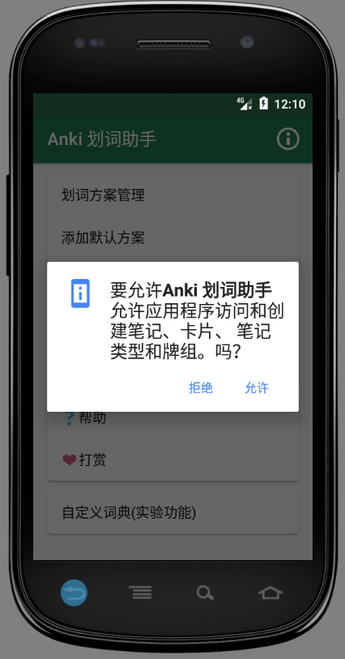
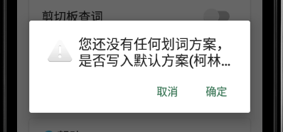
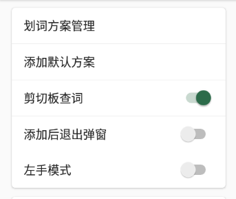
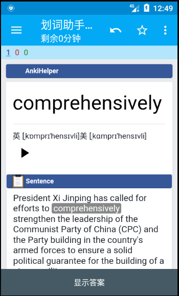
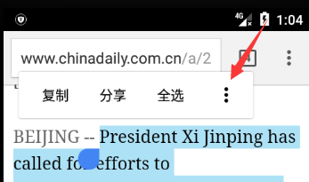
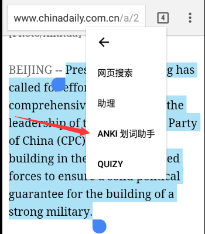

# Anki 划词助手 - 用户手册

距离开始开发“Anki 划词助手”已经过去接近一年半了，可是到现在还没有一篇像样的教程之类的东西，今天下了一个大大的决心，准备写一篇出来。

目录
=================

   * [Anki 划词助手 - 用户手册](#anki-划词助手---用户手册)
      * [这东西是干嘛的啊？](#这东西是干嘛的啊)
      * [怎么用啊？](#怎么用啊)
         * [如果你是 Anki 新手](#如果你是-anki-新手)
            * [剪切板划词](#剪切板划词)
            * [几个常见问题](#几个常见问题)
            * [Chrome 弹出菜单划词](#chrome-弹出菜单划词)
            * [FBReader 划词](#fbreader-划词)
         * [如果你 Anki 已经用得挺熟了](#如果你-anki-已经用得挺熟了)
         * [划词助手自带词典](#划词助手自带词典)
         * [划词助手输出项介绍](#划词助手输出项介绍)
      * [杂项](#杂项)
         * [标签功能](#标签功能)
         * [自定义词典](#自定义词典)

## 这东西是干嘛的啊？

这东西是个安卓 App，是用来配合另一个安卓 App “Ankidroid” 一起使用的。这个叫 Ankidroid 的应用是记忆卡片软件 Anki 的安卓版。Anki 这个软件呢简单来说就是电子化的记忆卡片，类似于
有的四六级词汇书送的那种正面是单词背面是释义的纸质卡片。Anki 这类电子化的记忆卡片相比于纸质卡片的一大优势就是有比较科学的复习算法，像 Anki 里用的复习算法就是基于间隔重复（Spaced Repetition)原理的
SM2 算法。这类算法如果追究细节那么解释起来是比较麻烦的，其实我也不懂。简单来说它就是根据你对某张卡片内容熟悉程度的选择，来安排同一张卡片下一次出现的时间，并且这次和下次的时间间隔会随着你对内容掌握程度的加深变得越来越长，这也就是间隔重复这个名词的由来。比方说我今天往 Anki 里加了一张卡片，正面是“cat”，背面是“猫”。我在复习卡片的时候就可能碰到了这张卡片的正面“cat”，那么此时我就要回忆背面是啥，如果我回忆出来了，我就选“good”这个记忆程度选项，于是这张卡片可能今天就不会再出现了，而是等到我明天复习卡片的时候再出现。第二天我再次碰到 cat 这张卡片的时候，我还是能记起来是啥意思的话，可能这张卡片就是在4天后才出现。等到我 4 天后又回忆出来的话，这个时间间隔可能一下子就变成了 7 天。这个时间间隔会一直增长下去，
直到软件里设定的最长时间间隔（有可能是100年哦）。假如中间哪次没回忆出来 cat 的意思，那么就一夜回到解放前了，时间间隔可能从 1 天开始重新往上涨。

当然这只是对 Anki 的一个很粗糙的介绍，具体的 Anki 教程可以看看知乎上余时行老师的 [Anki 专栏](https://zhuanlan.zhihu.com/-anki)，特别是这篇[终极汇总](https://zhuanlan.zhihu.com/p/21328602)。

有很大一部分人用 Anki 是为了学习语言的，用来学习语言的时候一个很常见的需求就是把阅读文章或者书籍时遇到的生词记录到 Anki 里做成卡片。在电脑上制作这种卡片其实还是比较方便的，把单词复制到卡片正面，然后从词典软件把需要的解释复制到背面即可。同时，在电脑端也有不少简化此类制卡操作的插件，比如 [WordQuery](https://github.com/finalion/WordQuery) 和老黄的 Chrome 插件[在线词典助手](https://github.com/ninja33/ODH)。

但是在安卓手机上情况就变得麻烦多了。假如你在外国新闻网站上读新闻看到一个不认识的单词想把它制作成卡片，由于手机操作的局限性那将是非常痛苦的体验，需要在各种不同的 App 间来回切换，复制过来复制过去，等到做好一张卡，可能刚才新闻读到哪都忘了。所以我在去年开发了“Anki 划词助手”这个应用，用来简化这类痛苦的操作。

## 怎么用啊？

### 如果你是 Anki 新手

如果你以前没用过 Anki，看了上面的介绍，也想试一试在阅读时记录生词并复习这种语言学习方法的话，可以接着往下看。

首先，你需要在安卓手机上装上 Ankidroid（什么？！你没有安卓手机...那你还看到这里了？）。如果在手机自带的应用商店没搜索到的话，可以到酷安网下载（[下载地址](https://www.coolapk.com/apk/com.ichi2.anki)。

打开了 Ankidroid 如果觉得一脸懵逼的话没关系，如果仅仅是为了用划词助手也不需要知道那么多。

接下来需要安装划词助手，同样也是到酷安网下载（[下载地址](https://www.coolapk.com/apk/com.mmjang.ankihelper)。如果你想持续收到更新的话，建议装个酷安的客户端。划词助手不在其他地方上架是因为 1. 上架 google play 需要双币信用卡而我没有 2. 上架华为应用市场这种国内大牌市场需要营业执照之类的东西而我一个个体户也没有 3. 小米商店我好像也申请了，还上传了手持身份证的照片，但是最后也没成功。

这时候不要犹豫，一定要选择同意啊。不同意没法用。不同意没法用。不同意没法用。如果手贱点了拒绝，自己到权限管理里改过来。

同意之后，会接着问题是否需要使用默认方案，如果你是第一次使用 Anki，而且你是用来学英语的话，我建议选择确定，对于新手会省去很多配置过程。

此时，基本的准备工作其实已经完成了。这时候界面上的几个选项其实只用关注“剪切板查词”这个，我建议把它打开。

#### 剪切板划词

现在开始第一次划词，用的是复制句子的方法。划词助手还支持其他多种划词方法，但是复制法是通用型最好的，所以先介绍这个。打开一个能复制英语句子的应用，可以是某个阅读器， 或者某个浏览器（关于浏览器我推荐 chrome，因为它可以在划词助手不在后台的时候调用划词助手。这里特别注意微信的自带浏览器和QQ浏览器可能是用不了复制划词的，所以尽量避免吧）。这里用 chrome 打开 chinadaily 举例子。

假如这篇新闻的第一段话里我不认识 comprehensively 这个单词，可以先把包含有这个单词的句子复制下来。

这是如果不出意外，就会有一个弹窗从地下冒出来，没错这个就是划词助手的界面了。如果没有弹窗，要检查划词助手是不是被杀了后台，或者主界面剪切板查词的选择没打开。

划词主界面上会看到刚才复制的句子，这里的句子其实每个单词都是可以点的。按照哪里不会点哪里的原则，点击 comprehensively，底下就会出现 comprehensively 的解释，每个释义的右边都有一个“+”按钮，这个按钮就是用来把刚才复制的句子、选定的单词、和当前释义一起送到 Ankidroid 制成卡片的了。对于这里的语境，可以知道第一个释义是最合适的，于是可以点击第一个加号按钮。

这时打开 Ankidroid，就可以看到刚才创建的划词助手默认牌组了，打开这个牌组，就可以看到刚才创建的卡片。正面是单词、音标、发音和句子。背面会多一个解释。要做的就是根据当前句子的语境回忆单词的意思。

正面：

背面：

#### 几个常见问题

**为什么要复制句子而不是直接复制单词？** 

单词出现的语境是非常重要的，如果仅仅是保存单词而忽略当时在文章里的用法，那还不如直接去背单词书。当然，如果你还是更喜欢直接复制单词，划词助手也是支持这种用法的。

**为什么每次只能保存一个释义而不是所有释义**

Anki 倡导记忆材料最小化原则，所以划词助手目前只能保存某个单词对应于语境的一项释义，这样可以保持卡片上需要记忆的内容尽量短小。以后可能会有同时添加多项释义的功能出现（坑）。

**为什么我点击加号的时候划词助手闪退了？**

保存卡片的时候划词助手需要调用 Ankidroid 的接口，部分手机会对应用间相互调用有较多的限制，所以导致调用不成功。可能的解决方法是：

1. 划词前打开 Ankidroid，并保持在后台（也许需要添加到后台清理白名单）
2. 对于某些应用，可能需要在权限管理之类的地方打开 Ankidroid 的自启动权限。

#### Chrome 弹出菜单划词

对于 Chrome 浏览器，除了用复制的方法划词，也可以在长按句子后弹出的菜单选择那个三个点的按钮，并选择“Anki 划词助手”选项唤出划词助手弹窗。这种方法的好处是不需要划词助手处于后台状态也能调用。

#### FBReader 划词

以上的划词方法虽然大大简化了制卡的步骤，但是仍然需要经过复制句子，选择单词这几个步骤。

如果你平时会看一些英文的电子书，如 epub、mobi、txt 等格式，推荐使用与划词助手配套的 FBReader 来划词。

FBReader 是一个开源的阅读器，支持常见的电子书格式。我通过钻研其源码，实现了这个阅读器与划词助手的联动，可以直接长按单词并调用划词助手，而且能自动识别当前单词所在的句子，不再需要人工复制句子了。

我修改的划词版 FBReader 可以在[这里](https://share.weiyun.com/502nZKN)下载。

这里需要注意，第一次打开看到的会是个黄色的空白界面。不要惊慌，软件没有装错。点击屏幕底部就可以看到主菜单了。

在主菜单选择“本地书柜”就可以打开本地的电子书。阅读时，长按某个生词，在弹出的菜单里会有一个星星一样的图标，选中这个就可以调用划词助手了。

【NEW!!! 1.1版新增回链功能】

之前的 FBReader 划词版已经可以在制作的卡片中保存书籍的名称和进度等信息，但是对于久远的卡片可能仍然会忘记卡片的具体语境，
为了解决这个问题，在 1.1 版中增加了“回链”功能。什么是“回链”功能呢？回链功能就是说用 FBReader 调用划词制作的卡片现在
会有一个“jump to source”链接，点击这个链接会自动打开 FBReader 并跳转到与这个卡片对应的原文位置，帮助你回忆起当时的语境。

要注意的是，这个“jump to source”链接目前是放在划词“笔记”输出项里的，所以设置方案的时候一定要记得为“笔记”项选择一个对应的
模板字段。

### 如果你 Anki 已经用得挺熟了

上面说的使用方法用的是默认的设置。其实如果你对 Anki 有些了解，明白什么是牌组、模板、字段的话，划词助手也提供了“方案编辑器”来自由定制划词策略。

首先需要解释一下“方案”这个概念。

“方案”这个概念在最早的划词助手中是没有的。当时如果我想在读网页的时候划词到一个牌组，读小说的时候划词的另一个不同的牌组，这就需要反复去修改设置，非常麻烦。“方案”这个概念相当于一套设置的集合，方便在划词时快速切换不同的设置组。

一个划词“方案”定义了用什么词典和模板怎样生成卡片，输出到哪个牌组中。也就是说每个划词方案都定义以下几项：

1. **方案名称** 顾名思义这就是用户给方案取的名字。比方说“柯林斯小说”这个方案可能用的就是内置的柯林斯词典，然后输出到某个专门用来放小说中生词的牌组。每个方案的名称都会出现在划词弹窗界面顶部的下拉菜单中，在划词时可以随意切换。

2. **词典** 这个是划词时所用的词典。目前划词助手内置了11种词典，另外还有一个并没有释义的特殊词典“制作填空”。内置的词典以英语词典为主，同时也包含了基本法、西、德、日的小语种词典。为了控制应用的体积，这里面只有新牛津英汉双解（ODE2）和柯林斯英汉双解这两本词典的数据是放在本地的，其他词典的数据都需要连接网络才能获取，所以速度上会慢一点。关于词典后面还会有详细介绍。

3. **牌组** 这个不需要多解释，就是指定制作的卡片要放到哪个牌组里。

4. **模板** 这个定义了制作卡片所使用的模板（也称笔记类型）。

5. **字段映射** 此设置项包含了 4 中所选模板中每个字段与划词助手输出项的对应关系。每个字段的下方都会有一个下拉菜单，用来选择与这个字段对应的输出项。关于输出项是什么这里也需要解释下：划词助手在添加一张卡片时会生成很多不同的数据，每一种不同的数据就以一个输出项来表示。输出项分为两类，一类是所有词典都共享的输出项，它们分别是“加粗的例句”、“挖空的例句”、“笔记”、“URL”。另一类输出项是每个词典特有的输出项，比如柯林斯英汉双解词典就包含“单词”、“音标”、“释义”、“有道美式发音”，“有道英式发音”、“复合项”。后面会介绍每个输出项的具体含义。

划词助手主界面的“划词方案管理”菜单就是用来增加、修改、删除方案的，了解了方案的概念，自己定制起来应该还是比较简单的。如果使用了助手的默认方案，可以看到方案管理界面里面已经存在一项了。

### 划词助手自带词典

下面介绍下划词助手自带的所有词典。

**新牛津英汉双解词典**

* 数据在本地，查询速度快，不依赖网络
* 权威出版社原文数据，收词量大，各种专业词汇全面
* 对于词汇的解释分为原始意义和引申义（以黑色方框开头的释义），很有特色
* 能较完美的处理时态、单复数等词尾变形
* 对于没有在新牛津收录的词会自动获取有道词典的释义

**柯林斯英汉双解**

* 数据同样在本地
* 收词量大约三万，但是英文释义用词简单，比较适合初学者
* 完美处理变形
* 自动获取有道释义

对于英语学习，我还是最推荐这两本本地的词典，做工精细。

**韦氏学习词典**

* 在线词典，数据获取自词典的官方网站
* 释义为英语，不含中文解释，难度同样不大但是比柯林斯要简洁
* 自带韦氏官网真人发音，品质很高

**Vocabulary.com**

* 释义来自 Vocabulary.com，会优先显示这个网站的特色解释型释义，随后也会显示 WordNet 的传统释义。释义难度总体来说是比较大的，适合高级学习者
* 同样会获取 Vocabulary.com 官网的真人发音

**牛津英汉双解**

* 也就是著名的牛津高阶词典，数据获取自必应词典官网
* 对词尾变形的处理不是很好

**Mnemonic 助记词典**

* 这个词典主要是用来获取单词的助记口诀的，数据来自 mnemonicdictionary.com 。我国人的网站，所以助记也都是英语的。

以上都是英文词典，下面是小语种词典。

**欧路西班牙语/法语/德语在线**

* 这三本词典的数据都来自于欧路的在线词典网站，小语种根本不懂，不过看起来对词形变化的处理还是不错的。

**沪江日语在线**

这本的数据来自沪江的日中词典，具体释义质量怎么样我不懂，反正是勉强能用。

**jisho.org**

这个是日英词典，不过最近很多用户表示用不了，可能是因为服务器在国外有时候访问超时了，所以优先用上面沪江那个吧。

### 划词助手输出项介绍

上面说到划词助手有几个所有词典都共用的输出项，其中：

**加粗的例句** 就是用户通过各种方式发送到助手弹窗的句子，选定的单词会被加粗，也就是加上`<b></b>`标签。

**挖空的例句** 同样是发送到主界面的句子，但是选定的单词会按照 anki 制作填空卡片的语法挖空。结合“制作填空”这个“伪”词典可用来制作阅读材料的填空题卡片。

**笔记** 划词助手支持笔记功能，也就是在划词弹窗的顶部的那个类似于纸笔的按钮，通过这个按钮可以输入一些辅助的信息，最后制卡时就会通过“笔记”这个输出项输出到卡片里。**在使用划词版 FBReader 时，这个输出项会被用来记录当前看的书的标题和进度**

**URL**  这个是用来和闪电浏览器结合使用的，用来记录当前网址。闪电浏览器目前在安卓8.0上还有一些 Bug，所以关于闪电浏览器的介绍以后再更新。

## 杂项

### 标签功能

Anki 里可对卡片加上一个或者多个标签，划词助手也支持直接制作带标签的卡片。在划词弹窗的左上角有一个形状像“书签”的按钮，可用来给当前卡片打标签，同时也支持设置默认标签，避免每次都输入标签的麻烦。

### 自定义词典

目前支持导入 tab 分割的词典数据，必须是utf8编码的纯文本。这里有一个[示例文件](custom_dictionary/collins.txt)可供参考：

文件最开始META和ENDMETA之间的部分是词典的元信息。格式是以“=”分割的键值对，
其中左边的大写单词（如DICT_NAME）是键，要严格照抄不能修改，右边属于自定义部分。

第2行 VERSION=1 是定义了词典文本的格式版本，这仅仅是为了以后升级文件格式方便而预留的。目前只需要写1就行了。
3行和第4行定义了词典的名称和介绍。
第5行定义词典的源语言：如果是英语词典，写“en”，日语写“jp”，法语写“fr”，具体参照国际标准语言代码。
第6行定义了词典里的数据如何在划词助手的释义界面上显示，也就是和anki模版类似的东西，允许使用简单的html。定义这个主要的考虑是有时可能并不需要词典里的所有内容都在划词助手的释义界面上显示出来。上面的例子里英文释义就不会显示。

第7行是词典的各个数据字段，这些字段必须和第四行的模版对应，而且这些字段会作为方案编辑器里对应词典的输出项。各个字段名称之间需要用tab分割。

从第9行开始就是实际的词典数据了，每行的各项之间需要用制表符（tab \t）分割。各列内容与第五行的各个字段依次对应。默认第一列的内容会作为词头（one two）。每行的数据个数一定要和第7行定义的个数一致。比如第9行24-7这个单词是没有音标的，但是24-7与adv之间仍然要有两个tab，24-7 \t\t adv...

文件中允许有空行，读取时会自动忽略。

